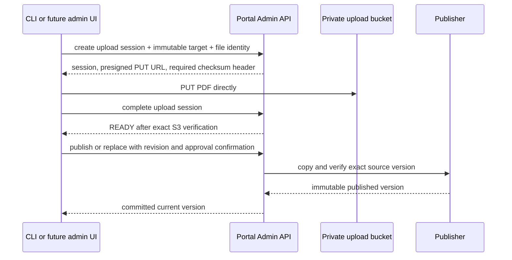

# API Contracts

## Canonical sources

The canonical runtime schemas are in `packages/contracts/src/`. In particular:

- `admin.ts` defines administration requests, revisions, pagination, and archive actions.
- `publication.ts` defines upload targets, upload sessions, report classifications, and publication requests.
- `client.ts` defines Client BFF responses and artifact access requests.
- `models.ts` defines the domain entities and allowed states.

The authenticated Admin API exposes a route inventory at `GET /admin/openapi.json`. It is useful for discovery, but the Zod contracts above are authoritative for request and response shapes.

## Client BFF

The dashboard uses relative same-origin `/bff/*` routes through Netlify. Browser JavaScript never receives Cognito tokens.

| Route group | Purpose |
| --- | --- |
| `GET /bff/auth/session`, `GET /bff/me` | Validate the opaque browser session and return the organization display name. |
| `GET /bff/me/projects` | List active projects in the authenticated user's organization. |
| `GET /bff/projects/{projectId}` | Get a visible project. |
| `GET /bff/projects/{projectId}/inspections` | List active, published inspections. |
| `GET /bff/projects/{projectId}/inspections/{inspectionId}/reports` | List all four client report classifications. |
| `POST .../reports/{reportType}/access` | Return a five-minute View or Download URL for the current verified report version. |
| `GET /bff/me/documents/how-to-read`, `POST .../access` | Read and access the current organization-level How to Read document. |
| `POST /bff/logout` | Revoke the portal session and return the Cognito logout redirect. |

All client mutations require the expected origin and the `x-bdr-csrf` header. Resource IDs in the browser never establish organization ownership. A `401` means the server session is absent, expired, or revoked; a `404` intentionally combines missing and client-invisible resources.

## Portal Admin API

The current consumer is the local CLI. It sends an access token as `Authorization: Bearer <token>`, first calls `POST /admin/auth/sessions`, then uses the same token for API operations. API Gateway and the Lambda both verify the administrator identity.

| Route group | Operations |
| --- | --- |
| `/admin/organizations` | List, create, get, and update organizations. |
| `/admin/organizations/{organizationId}/users` | List users, revoke a user, or invite a replacement identity. |
| `/admin/organizations/{organizationId}/invitations` | List, create, resend, and cancel invitations. |
| `/admin/organizations/{organizationId}/projects` | List, create, get, update, archive-preview, archive, restore-preview, and restore projects. |
| `/admin/organizations/{organizationId}/projects/{projectId}/inspections` | List, create, get, update, archive-preview, archive, restore-preview, restore, and publish inspections. |
| `.../inspections/{inspectionId}/reports` | List or update report classifications; publish, replace, withdraw, and list retained versions for individual report types. |
| `/admin/organizations/{organizationId}/documents/how-to-read` | Initialize, inspect, publish, replace, and list retained How to Read versions. |
| `/admin/organizations/{organizationId}/upload-sessions` | Create, inspect, complete, or recover an immutable upload session. |

The API returns `400` for invalid input/state, `401` for failed authentication, `403` for rejected administrator authorization, `404` for absent or non-visible resources, and `409` for revision or idempotency conflicts. UI code must display a recoverable error for `409` and reload the current resource instead of retrying stale mutations automatically.

## Mutation rules

- Create organization, invitation, project, inspection, How to Read initialization, and upload-session requests require an `Idempotency-Key` header. The CLI creates one automatically; an admin UI must do the same.
- Update, archive, restore, withdraw, publish, replace, and report-classification requests require the server-provided `expectedRevision`. Re-read the resource after a `409` before asking an operator to try again.
- Archive requests also require a non-empty reason. The archive/restore preview result supplies the revision to submit and the impact to show the operator.
- Publication requests require `approvalConfirmed: true`, `approvalStatementVersion: "bdr-approval-v1"`, the exact project ID for inspection reports, and a verified `READY` upload session.
- Client-visible report versions are immutable. Replacing a report or How to Read document creates a new version; it never overwrites a published object.

## Upload lifecycle



Upload sessions have the states `UPLOADING`, `READY`, `PUBLISHING`, `PUBLISHED`, and `FAILED`. The maximum PDF size is 100 MB. An interrupted single-part upload has no byte-range resume: the caller uses the same session's `upload-url` endpoint to detect a completed object or obtain a replacement URL, then restarts the upload if needed.

The upload target is authoritative and cannot change after creation:

```ts
type InspectionReportTarget = {
  kind: "INSPECTION_REPORT";
  organizationId: string;
  projectId: string;
  inspectionId: string;
  reportType: "ASSESSMENT" | "EVIDENCE" | "ROOF_TAKEOFF" | "CAPITAL_PLANNING";
};

type OrganizationDocumentTarget = {
  kind: "ORGANIZATION_DOCUMENT";
  organizationId: string;
  documentType: "HOW_TO_READ";
};
```

## Future ReportGen UI boundary

The future UI must be an Admin API client. It must not directly write DynamoDB, create Cognito users, sign report URLs, or copy files between S3 buckets. The current Portal Admin Cognito authentication remains the only implemented administration path. If ReportGen identity is later accepted, the integration must be explicit, retain the CLI, preserve `adminId`-based audit records, and require TOTP for every ReportGen user.
