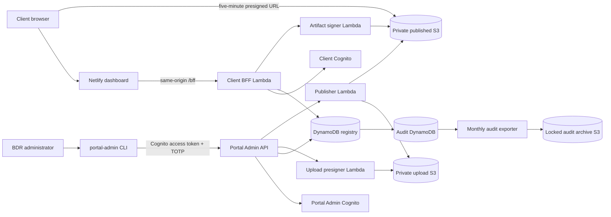

# BDR Inspections Dashboard Architecture

## Purpose and current status

The BDR Inspections Dashboard is the client-facing portal for published BDR inspection reports. V1 is deployed and operated independently from ReportGen. Clients can view buildings, published inspections, organization-level How to Read guidance, and current PDF report versions. BDR staff currently administer the portal with the authenticated `portal-admin` CLI.

ReportGen remains the internal system that creates reports. It does not have access to portal tables or portal buckets, and it is not yet integrated with the portal administration API.

## System overview



Development and production are isolated stacks in `us-east-1`. They have separate Cognito pools, APIs, DynamoDB tables, buckets, KMS keys, alarms, and client records.

## Domain and visibility model

```text
Organization
├── Client users
├── How to Read document → immutable document versions
└── Projects / buildings
    └── Inspections / scans
        └── Four report categories → immutable report versions
```

Every entity has an opaque ID. A client user belongs to exactly one organization. A project has a required building IANA timezone; every inspection stores an immutable copy of that timezone with its scan time.

Only an active organization, active project, active and published inspection, published report classification, and verified current version can produce a client PDF URL. The same predicate applies to collection routes and direct report access. Missing, foreign, draft, archived, unpublished, or invalid resources resolve to the same client-facing `404`.

The report categories are Assessment, Evidence, Roof Takeoff, and Capital Planning. Each published inspection explicitly classifies every category as `PUBLISHED`, `EXPECTED`, `NOT_INCLUDED`, or `NOT_APPLICABLE`. How to Read is an organization-level document and never appears as an inspection report.

## Publication and storage

Manual uploads use a server-generated immutable upload target. The CLI validates file size, `%PDF-` header, and SHA-256, uploads directly to the private upload bucket, then asks the Admin API to verify the exact S3 object version. Only a `READY` upload can publish.

Publication copies the verified source object to an immutable `versions/{versionId}.pdf` key in the private published bucket, verifies the destination, and then commits the registry pointer in DynamoDB. A failed copy or transaction never makes a new version visible. Replacement creates a new version and moves only the logical report's `currentVersionId`; clients never access superseded versions.

The client BFF authorizes a request before the artifact signer issues a five-minute URL. Published objects are private, versioned, KMS-encrypted, and protected by S3 Block Public Access. Browser network tools can see the S3 hostname, opaque object key, and S3 version ID in an issued URL; those values are not authorization credentials and are not displayed in the product UI.

## Authentication and administration

Client authentication uses Cognito Managed Login with authorization-code flow and PKCE. The Client BFF stores Cognito tokens server-side and gives the browser only a host-only, secure, HttpOnly opaque session cookie. Every request checks the server-side session, user status, and organization status.

The current administration path is separate from client authentication:

- The local `portal-admin` CLI signs in through the Portal Admin Cognito pool with TOTP.
- The CLI uses an in-memory access token and calls the Portal Admin API.
- The API requires the Cognito group, a live active `AdminProfile`, an explicit issuer/sub identity mapping, an active AdminSession, and confirmed software-token MFA.
- The CLI has no AWS data-plane credentials. Upload and publication permissions remain in narrowly scoped portal Lambda roles.

The CLI remains supported. A future ReportGen admin UI must use the Admin API rather than portal tables or buckets directly. Its authentication and cutover design are intentionally open for the ReportGen owner. Any design must preserve explicit identity mapping from an authenticated subject to `adminId`, complete audit attribution, and TOTP for every ReportGen user. It must never map privileged users by email, name, or Cognito group alone.

## Operational safeguards

All portal DynamoDB tables use point-in-time recovery, customer-managed encryption, deletion protection, and retained removal policies. Audit events are append-only application records with a six-month TTL; EventBridge exports them on the first day of each month to a KMS-encrypted S3 Object Lock archive with 184-day governance retention.

CloudWatch alarms cover Lambda errors/throttles, API 5xx responses, DynamoDB throttles, audit-export failures, EventBridge delivery failures, and forbidden audit mutations. CloudTrail records writes and deletes to the published-object prefix and writes to the audit table.

See [API contracts](./api-contracts.md), [project layout](./project_layout.md), and the [runbooks](./runbooks/).
