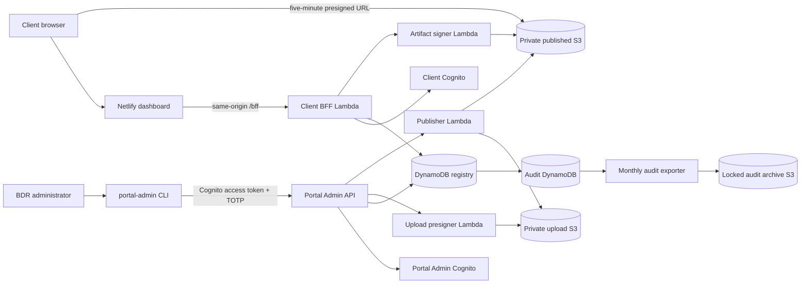

# BDR Inspections Dashboard Architecture

## Purpose and current status

The BDR Inspections Dashboard is the client-facing portal. It has two data paths, described in [backend](./backend.md) and [frontend](./frontend.md).

- **Registry.** DynamoDB projects, inspections, and private portal-bucket PDFs. Staff publish those with the `portal-admin` CLI and the Portal Admin API. ReportGen does not write those tables or buckets.
- **Shared buildings.** ReportGen and this dashboard use `reportgen_portal/org_links.json` and approved report state under `{building}reportgen/client_portal/` on `bdr-roofus-uploads`. The dashboard adds an opaque physical-building/inspection catalog in tenant DynamoDB so multiple source uploads can be grouped deliberately without treating S3 paths as tenant or building identity.

History: [CHANGELOG.md](../CHANGELOG.md).

## System overview


```mermaid
flowchart LR
  Client[Client browser] --> Netlify[Netlify dashboard]
  Netlify -->|same-origin /bff| BFF[Client BFF Lambda]
  BFF --> ClientCognito[Client Cognito]
  BFF --> Registry[(DynamoDB registry)]
  BFF --> Signer[Artifact signer Lambda]
  Signer --> Published[(Private published S3)]
  Client -->|five-minute presigned URL| Published

  Admin[BDR administrator] --> CLI[portal-admin CLI]
  CLI -->|Cognito access token + TOTP| AdminAPI[Portal Admin API]
  AdminAPI --> AdminCognito[Portal Admin Cognito]
  AdminAPI --> Registry
  AdminAPI --> Upload[Upload presigner Lambda]
  AdminAPI --> Publisher[Publisher Lambda]
  Upload --> Staging[(Private upload S3)]
  Publisher --> Staging
  Publisher --> Published

  Registry --> Audit[(Audit DynamoDB)]
  Audit --> Exporter[Monthly audit exporter]
  Exporter --> Archive[(Locked audit archive S3)]
```

Development and production are isolated stacks in `us-east-1`. They have separate Cognito pools, APIs, DynamoDB tables, buckets, KMS keys, alarms, and client records.

## Domain and visibility model

```text
Organization
├── Client users
├── How to Read document → immutable document versions
└── Projects / buildings
    └── Inspections / scans
        └── Four report categories → immutable report versions
```

Every entity has an opaque ID. A client user belongs to exactly one organization. A project has a required building IANA timezone; every inspection stores an immutable copy of that timezone with its scan time.

Only an active organization, active project, active and published inspection, published report classification, and verified current version can produce a client PDF URL. The same predicate applies to collection routes and direct report access. Missing, foreign, draft, archived, unpublished, or invalid resources resolve to the same client-facing `404`.

The report categories are Assessment, Evidence, Roof Takeoff, and Capital Planning. Each published inspection explicitly classifies every category as `PUBLISHED`, `EXPECTED`, `NOT_INCLUDED`, or `NOT_APPLICABLE`. How to Read is an organization-level document and never appears as an inspection report.

## Publication and storage

Manual uploads use a server-generated immutable upload target. The CLI validates file size, `%PDF-` header, and SHA-256, uploads directly to the private upload bucket, then asks the Admin API to verify the exact S3 object version. Only a `READY` upload can publish.

Publication copies the verified source object to an immutable `versions/{versionId}.pdf` key in the private published bucket, verifies the destination, and then commits the registry pointer in DynamoDB. A failed copy or transaction never makes a new version visible. Replacement creates a new version and moves only the logical report's `currentVersionId`; clients never access superseded versions.

The client BFF authorizes a request before the artifact signer issues a five-minute URL. Published objects are private, versioned, KMS-encrypted, and protected by S3 Block Public Access. Browser network tools can see the S3 hostname, opaque object key, and S3 version ID in an issued URL; those values are not authorization credentials and are not displayed in the product UI.

## Authentication and administration

Client authentication uses Cognito Managed Login with authorization-code flow and PKCE. The Client BFF stores Cognito tokens server-side and gives the browser only a host-only, secure, HttpOnly opaque session cookie. Every request checks the server-side session, user status, and organization status.

The current administration path is separate from client authentication:

- The local `portal-admin` CLI signs in through the Portal Admin Cognito pool with TOTP.
- The CLI uses an in-memory access token and calls the Portal Admin API.
- The API requires the Cognito group, a live active `AdminProfile`, an explicit issuer/sub identity mapping, an active AdminSession, and confirmed software-token MFA.
- The CLI has no AWS data-plane credentials. Upload and publication permissions remain in narrowly scoped portal Lambda roles.

The CLI remains the administration path for the registry. ReportGen operators use their own app to release buildings and send PDFs on the shared-file path. Client-site pages under `/bff/portal/*` approve those PDFs, manage linked client folders, and serve the building, map, and review views. A non-admin `GET /bff/me` omits the `admin` field so the previously published dashboard schema still accepts the account payload. Admin sessions include `admin: true`.

## Operational safeguards

All portal DynamoDB tables use point-in-time recovery, customer-managed encryption, deletion protection, and retained removal policies. Audit events are append-only application records with a six-month TTL; EventBridge exports them on the first day of each month to a KMS-encrypted S3 Object Lock archive with 184-day governance retention.

CloudWatch alarms cover Lambda errors/throttles, API 5xx responses, DynamoDB throttles, audit-export failures, EventBridge delivery failures, and forbidden audit mutations. CloudTrail records writes and deletes to the published-object prefix and writes to the audit table.

## Shared building portal

The shared path does not publish into the inspection registry. S3 remains the source of approved ReportGen artifacts and upload-completion evidence. The tenant table stores the physical building, ordered inspections, selected source sections, report classifications, optional published As-built artifact, revision, and exclusive source claims. Existing client-visible sources are represented provisionally with deterministic opaque IDs; the first edit or administrative workflow materializes the record.

An administrator discovers S3 candidates and explicitly attaches only completed sections to a physical building. Partial or interrupted sections fail closed. The latest inspection is derived from scan/upload time, and earlier attached inspections become previous inspections. Report version history inside one source is not presented as a previous physical inspection.

Clients receive five fixed report types per inspection: Roof Assessment, Inspection Evidence, Roof Takeoff, As-built, and Capital Planning. Approved non-stale source artifacts and explicitly published As-built files are Available. Other rows use administrator-controlled In preparation or Not included classifications. File authorization resolves the S3 key on the server from the caller’s organization plus opaque building, inspection, and report identifiers.

Building metadata edits do not alter publication state. Attachment, classification, metadata materialization/update, and As-built publication use optimistic revisions and append an audit event in the same DynamoDB transaction. The legacy raw status/action endpoint is retained for administrator operations and rejects client sessions.

See [backend](./backend.md), [frontend](./frontend.md), [API contracts](./api-contracts.md), [project layout](./project_layout.md), and the [runbooks](./runbooks/).
